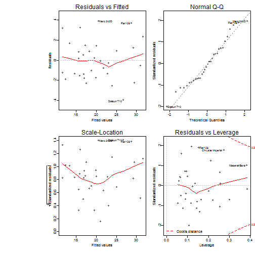

Transmission Effects On MPG In Cars
====================================


## 1. Executive Summary
This paper is based at 1974 Motor Trend Data that contains fuel consumption related with 10 aspects of automobile design and performance for 32 cars models 1973-74. The purpose is to estimate the effect of the type of transmission (automatic vs manual) on the miles per gallon (MPG). The results suggest that manual transmission have a higher MPG. However the weight and acceleration are attibutes that have a siginficant influence in the results.

## 2. Exploratory Data Analysis
Based on common sense we can assume that the mpg of a car depends on its weight and its power, also the cars with more cylinders have a great acceleration and more horse power. The following plot shows these theories.

 


The left plot offer following insights:
* The cars with automatic transmission are heavy.
* The cars with manual transmission are lightweight.
* A positive relationship between number of cylinders and weight.
* A negative relationship between MPG and weight.

The right plot offer following insights:
* A strong relationship between acceleration and horse power.
* Cars with more cylinders has great acceleration in lest time.
* Cars with more cylinders provides major horsepower.
* Cars with more horsepower have automatic transmission.

Also see the correlation matrix in the Appendix.

## 3. Models
The exploratory analysis suggested to use the wt variable with some power variables (cyl, hp) is a good start. An interesting insight is the acceleration that is strongly influenced by 8 cylinders cars therefore we will evaluate it. The models to analyze are:


```
## mpg ~ am:wt + am:cyl
```

```
##                  Estimate Std. Error t value  Pr(>|t|)
## (Intercept)        33.820     2.7313  12.382 3.656e-12
## amAutomatic:wt     -3.409     0.8671  -3.931 5.912e-04
## amManual:wt        -2.981     1.3630  -2.187 3.831e-02
## amAutomatic:cyl6   -3.143     2.0524  -1.531 1.382e-01
## amManual:cyl6      -5.041     2.1177  -2.380 2.524e-02
## amAutomatic:cyl8   -4.780     2.0536  -2.327 2.834e-02
## amManual:cyl8      -8.374     2.8825  -2.905 7.574e-03
```

```
## mpg ~ am:wt + am:hp
```

```
##                Estimate Std. Error t value  Pr(>|t|)
## (Intercept)    36.21665    2.40962  15.030 1.226e-14
## amAutomatic:wt -3.36820    0.95787  -3.516 1.566e-03
## amManual:wt    -3.29638    1.48606  -2.218 3.514e-02
## amAutomatic:hp -0.03846    0.01584  -2.428 2.214e-02
## amManual:hp    -0.03300    0.01406  -2.347 2.650e-02
```

```
## mpg ~ am:wt + am:qsec
```


```r
summary(model3)
```

```
## 
## Call:
## lm(formula = mpg ~ am:wt + am:qsec, data = mtcarst)
## 
## Residuals:
##    Min     1Q Median     3Q    Max 
## -3.936 -1.402 -0.155  1.269  3.886 
## 
## Coefficients:
##                  Estimate Std. Error t value Pr(>|t|)    
## (Intercept)        13.969      5.776    2.42   0.0226 *  
## amAutomatic:wt     -3.176      0.636   -4.99  3.1e-05 ***
## amManual:wt        -6.099      0.969   -6.30  9.7e-07 ***
## amAutomatic:qsec    0.834      0.260    3.20   0.0035 ** 
## amManual:qsec       1.446      0.269    5.37  1.1e-05 ***
## ---
## Signif. codes:  0 '***' 0.001 '**' 0.01 '*' 0.05 '.' 0.1 ' ' 1
## 
## Residual standard error: 2.1 on 27 degrees of freedom
## Multiple R-squared:  0.895,	Adjusted R-squared:  0.879 
## F-statistic: 57.3 on 4 and 27 DF,  p-value: 8.42e-13
```

The stimation results reveal that model 3 is the best fit.


### 3.1 Model Validation
The model has a 88% Adjusted R-Squared, and contains three variables (transmission type, weight, and acceleration) along with the transmission interaction. The residuals are normal with 0 mean and constant variance. The "Residual vs Fitted" and "Scale Location" charts show that there is no trend to the residuals. The Q-Q plot shows that the errors are aproximately distributed. The p-values for am are considered statistically significant.

### 3.2 Model Interpretation
**For constant quarter-mile-time:** For each unit of increase in quarter-mile-time (1 unit = 1 sec), there is a 0.834 mpg increase for automatic cars while there is a 1.446 mpg increase for manual cars. This means manual cars have more efficient acceleration than automatic but in both cases require more fuel. 

**For constant weight (lb/1000):** For each unit of increase in weight (1 unit = 1000 lb) there is 3.176 decrease for automatic cars while there is a 6.099 mpg decrease for manual cars. This means heavier cars in general require more fuel altought automatic cars consumes less fuel than manual.


## Appendix

### MPG against all variables

```r
require(graphics)
panel.cor <- function(x, y, digits = 2, prefix = "", cex.cor, ...) {
    usr <- par("usr")
    on.exit(par(usr))
    par(usr = c(0, 1, 0, 1))
    r <- cor(x, y)
    txt <- format(c(r, 0.123456789), digits = digits)[1]
    txt <- paste(prefix, txt, sep = "")
    if (missing(cex.cor)) 
        cex.cor <- 0.8/strwidth(txt)
    text(0.5, 0.5, txt, cex = cex.cor * abs(r))
}
pairs(mpg ~ am:., data = mtcarst, lower.panel = panel.smooth, upper.panel = panel.cor, 
    pch = 20, main = "Scatterplot - Correlation Matrix")
```

 


### Selected Model Plot

```r
par(mfrow = c(2, 2), cex.main = 0.1, cex = 0.6, mgp = c(1.7, 0.5, 0), mar = c(4, 
    3.5, 2, 0.5), oma = c(0.5, 10, 0.5, 0.5))
plot(model3)
```

 

