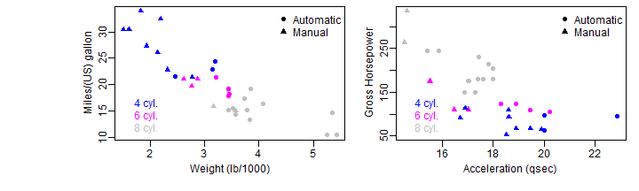
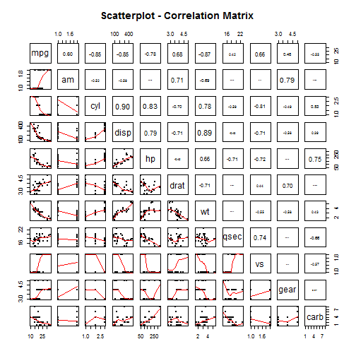

Transmission Effects On MPG In Cars
====================================


## 1. Executive Summary
This paper is based at 1974 Motor Trend Data that contains fuel consumption related with 10 aspects of automobile design and performance for 32 cars models 1973-74. The purpose is to estimate the effect of the type of transmission (automatic vs manual) on the miles per gallon (MPG). The results suggest that manual transmission have a higher MPG. However the weight and horse power are attibutes that have a siginficant influence in the results.

## 2. Exploratory Data Analysis
Based on common sense we can assume that the mpg of a car depends on its weight and its power, also the cars with more cylinders have a larger displacement and more horse power. The following plot shows these theories.

 


The left plot offer following insights:
* 2.1.1 The cars with automatic transmission are heavy.
* 2.1.2 The cars with manual transmission are lightweight.
* 2.1.2 A positive relationship between number of cylinders and weight.
* 2.1.3 A negative relationship between MPG and weight.

The right plot offer following insights:
* 2.2.1 A linear relationship between displacement and horse power.
* 2.2.2 There is not a relation between number of cylinders and displacement.
* 2.2.3 Cars with more cylinders provides major horsepower.
* 2.2.4 Cars with more horsepower have automatic transmission.


#Models
We need to check that a relationship does exist between MPG and Transmission with a simple linear model.


```r
model1 <- lm(mpg ~ am, mtcarst)
summary(model1)$coefficients
```

```
##             Estimate Std. Error t value  Pr(>|t|)
## (Intercept)   17.147      1.125  15.247 1.134e-15
## amManual       7.245      1.764   4.106 2.850e-04
```

We can see a strong relationship does exist with a p-value < 0.001 considering only transmission. However we have to evaluate this factors: weight, and number of cylinders.


```r
model2 <- update(model1, mpg ~ am + wt)
summary(model2)$coefficients
```

```
##             Estimate Std. Error  t value  Pr(>|t|)
## (Intercept) 37.32155     3.0546 12.21799 5.843e-13
## amManual    -0.02362     1.5456 -0.01528 9.879e-01
## wt          -5.35281     0.7882 -6.79081 1.867e-07
```


```r
model3 <- update(model1, mpg ~ am + wt + cyl)
summary(model3)$coefficients
```

```
##             Estimate Std. Error t value  Pr(>|t|)
## (Intercept)  39.4179     2.6415 14.9228 7.425e-15
## amManual      0.1765     1.3045  0.1353 8.933e-01
## wt           -3.1251     0.9109 -3.4309 1.886e-03
## cyl          -1.5102     0.4223 -3.5764 1.292e-03
```


# Appendix
## Data
The data frame consists of 32 observations on 11 variables.
- mpg: Miles/(US) gallon
- cyl: Number of cylinders
- disp: Displacement (cu.in.)
- hp: Gross horsepower
- drat: Rear axle ratio
- wt: Weight (lb/1000)
- qsec: 1/4 mile time
- vs: V/S
- am: Transmission (0 = automatic, 1 = manual)
- gear: Number of forward gears


```
##                    mpg cyl disp  hp drat    wt  qsec      vs        am
## Mazda RX4         21.0   6  160 110 3.90 2.620 16.46 Vengine    Manual
## Mazda RX4 Wag     21.0   6  160 110 3.90 2.875 17.02 Vengine    Manual
## Datsun 710        22.8   4  108  93 3.85 2.320 18.61 Iengine    Manual
## Hornet 4 Drive    21.4   6  258 110 3.08 3.215 19.44 Iengine Automatic
## Hornet Sportabout 18.7   8  360 175 3.15 3.440 17.02 Vengine Automatic
## Valiant           18.1   6  225 105 2.76 3.460 20.22 Iengine Automatic
##                   gear carb
## Mazda RX4            4    4
## Mazda RX4 Wag        4    4
## Datsun 710           4    1
## Hornet 4 Drive       3    1
## Hornet Sportabout    3    2
## Valiant              3    1
```


## MPG versus Transmission

```r
op <- par(mar = c(2, 2, 1, 1))
boxplot(mpg ~ am, data = mtcarst)
stripchart(mpg ~ am, data = mtcarst, vertical = T, method = "jitter", pch = 20, 
    add = T)
```

 

```r
par(op)
```

## MPG against all variables

```r
require(graphics)
pairs(mpg ~ ., data = mtcarst, panel = panel.smooth)
```

 


